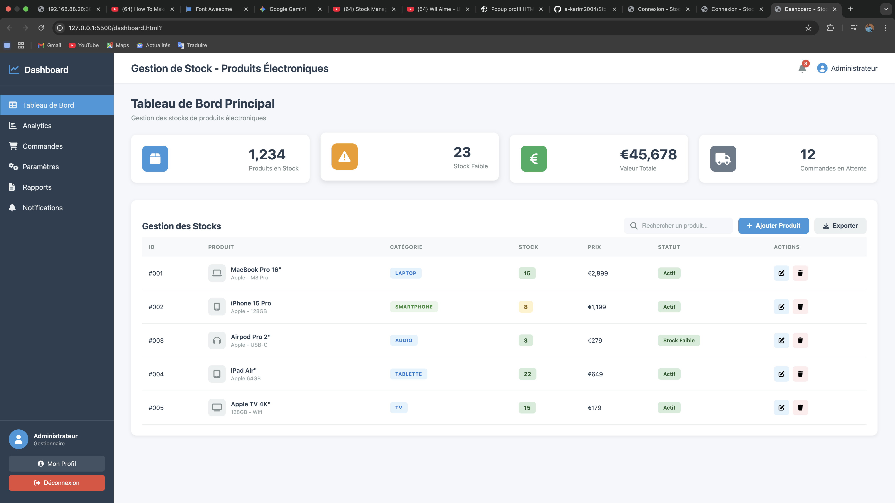

 Dashboard - StockManager

Ce projet est une application web de gestion de stock pour produits électroniques. Il propose une interface moderne permettant de suivre les produits, gérer les commandes, consulter des statistiques et effectuer des actions courantes de gestion.


 # PS: ya trop de modification a y apporter serièusement

## Fonctionnalités principales

- Tableau de bord avec statistiques (produits en stock, stock faible, valeur totale, commandes en attente)
- Gestion des produits : ajout, édition, suppression
- Recherche et export des produits
- Navigation entre différentes sections : Analytics, Commandes, Paramètres, Rapports, Notifications
- Profil utilisateur et déconnexion

## Structure du projet

- **dashboard.html** : Page principale du tableau de bord
- **dashboard.css** : Styles de l’interface
- **Font Awesome** : Utilisé pour les icônes
- Autres pages : `analytics.html`, `commandes.html`, etc. (à créer selon les besoins)

## Installation

1. Clone le dépôt :
   ```bash
   git clone <url-du-repo>
   ```
2. Ouvre le dossier dans VS Code.
3. Lance le fichier `dashboard.html` dans ton navigateur.

## Difficultés rencontrées
 Vraiment j'ai dirait pas que ya eu trop mais plutos des modification seron les bienvenue vue que l'IA ma beaoucoup aider a monter se projet vue en vigueur des jour qui me reste suis obligé d'utiliser _70%_ de L'IA dont les _30%_ j'ai aquis 
 mais askip revenon aux projet je jamais sue qu'on pouvait fair plusieur fichier _html_ tous dans un lien avec un seul _css_  Y comprise la liaisons des different input c'etais ma premiér experiènce est vraiment je adoré le peut de temps la que j'ai eu a fair grace a des competence intense  

---

## Auteur

- Nom : [A_Karim]
- Contact : [mamanemoussaabdoulkarim17@gmail.com]
   # voilà un apperçus de ma page stock-manager

